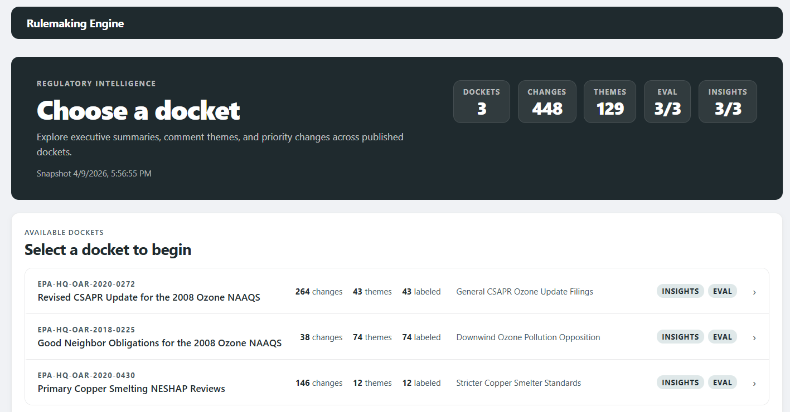
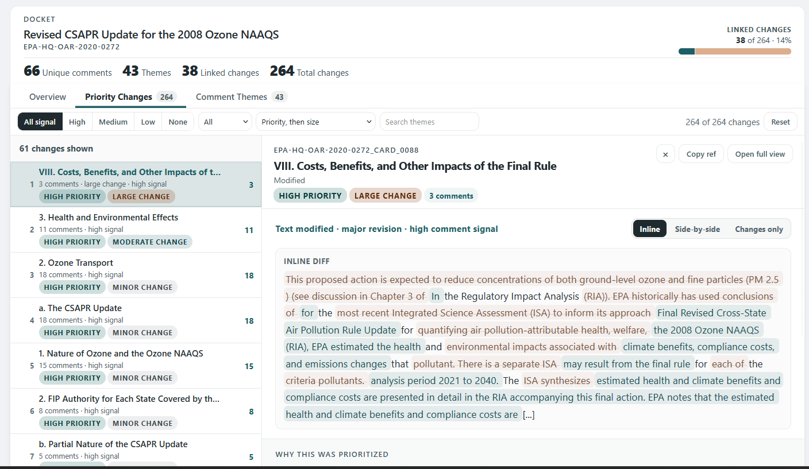
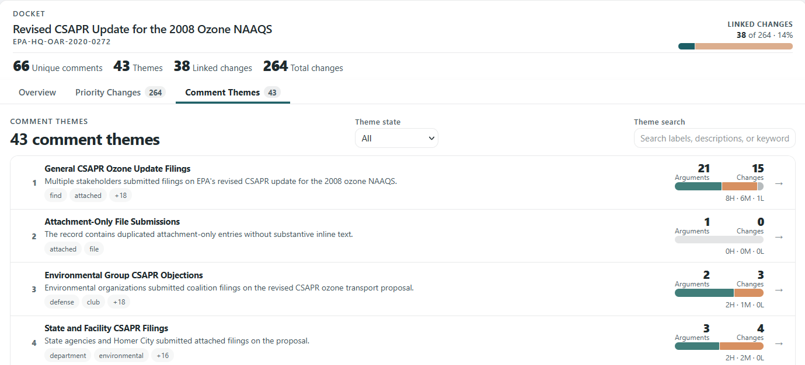
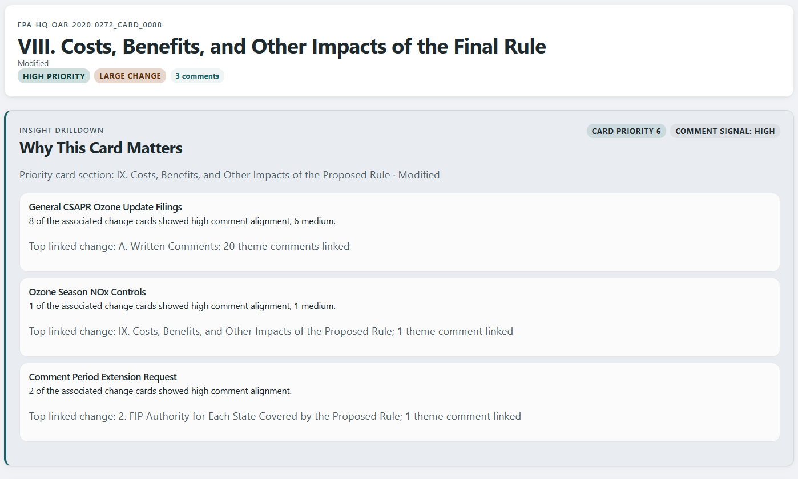

# Rulemaking Engine

**Automated analysis of how federal rules change between proposal and adoption, and whether public comments influenced those changes.**

When a federal agency like the EPA proposes a new regulation, the public has a window to submit comments. The agency must consider those comments before issuing the final rule. But proposed rules routinely span hundreds of pages, attract thousands of comments, and change in ways that are nearly impossible to trace by hand.

This project builds a complete pipeline that fetches proposed and final rule text, diffs every section, clusters public comments into themes, and surfaces where comment pressure may have shaped the final language — all presented through an interactive analyst surface.



---

## What It Produces

The pipeline processes three EPA rulemaking dockets end-to-end and publishes a static site where every claim is traceable to source text:

**448 regulatory changes** identified and diffed across **129 comment themes** derived from **267 unique public comments**.

Each change card shows:
- The proposed vs. final text with inline or side-by-side diffs
- Which comment themes align with that section
- A priority ranking based on comment volume, change magnitude, and alignment signal
- An evidence note explaining why the card was flagged

The site is read-only and makes no model calls at runtime — everything is pre-computed and published as static JSON.

---

## How AI Is Used

AI is used at two points in the pipeline, both offline and auditable:

**Cluster labeling** — After comments are deduplicated and clustered by keyword similarity, an AI agent generates human-readable theme labels and descriptions for each cluster. This replaces what would otherwise be hours of manual annotation across dozens of clusters per docket.

**Insight synthesis** — For each docket, an AI agent generates an executive summary, top findings, and per-card evidence drilldowns. These explain *why* a change matters in plain language, connecting comment themes to specific regulatory sections. The generated text is checked against a banned-phrase list to prevent causal overclaims (the system surfaces correlation, not causation).

Separately, AI is also used to bootstrap the **evaluation baseline**: pipeline accuracy is measured against AI-generated gold sets that are blinded — the annotation packets strip identifying information so the evaluator can't reverse-engineer expected answers from the pipeline output. This provides a reproducible accuracy baseline without requiring human annotators.

The AI never runs in the product path. The site serves pre-computed artifacts only.

---

## Site Features

### Home — Docket Launcher
Three-docket overview with aggregate stats, insight preview titles pulled from the top finding of each docket's analysis, and quick-nav to any docket.

### Overview — Executive Summary
AI-generated docket analysis with what changed, what commenters emphasized, where the final text aligned with public input, and caveats. Top findings are displayed as evidence-linked cards. A collapsible evaluation section shows pipeline accuracy metrics.

### Priority Changes — Ranked Change List
All change cards ranked by a composite score of comment volume, change magnitude, and alignment signal. Filterable by signal level (high/medium/low/none), change type (modified/added/removed), and searchable by theme keyword. Cards with no comment linkage are folded behind a "show more" toggle to keep the analyst focused.

Selecting a card opens a side panel with:
- Inline, side-by-side, or changes-only diff views
- "Why this was prioritized" evidence bullets
- Insight drilldown with linked findings
- Related comment themes with comment counts



### Comment Themes — Cluster Explorer
All comment clusters with theme labels, descriptions, top keywords, argument/change counts, and a signal breakdown bar. Clicking a theme filters the priority changes view to show only cards linked to that theme.



### Full Card View
Dedicated page per change card with the complete insight drilldown, text diff, evidence note, and all linked comment themes — useful for deep review or sharing a specific finding.



---

## Pipeline Architecture

The pipeline is local-first and artifact-first. Each stage reads from the previous stage's output files, so any step can be re-run independently.

```
Federal Register API ──→ fetch_corpus.py ──→ corpus/
Regulations.gov API  ──↗

corpus/ ──→ align_corpus.py ──→ aligned sections + comment attribution
       ──→ dedup_comments.py ──→ deduplicated comment families
       ──→ generate_change_cards.py ──→ 448 change cards with diffs
       ──→ cluster_comments.py ──→ 129 comment clusters

corpus/ ──→ generate_outputs.py ──→ outputs/ (report.json, CSV, HTML)
       ──→ evaluate_pipeline.py ──→ eval_report.json
       ──→ generate_insights.py ──→ insight_report.json

outputs/ ──→ publish_site_snapshot.py ──→ site_data/current/
site_data/current/ ──→ site_app (React) ──→ static site
```

### Key algorithms

**Section alignment** — A four-stage cascade matches proposed sections to final sections: exact heading match, fuzzy Jaccard similarity (threshold 0.5), body-text keyword assistance, then sequential fallback. Achieves 65-96% section coverage depending on how much the rule restructured between proposal and adoption.

**Comment deduplication** — Character 5-gram signatures with zlib CRC32 minhashing and Union-Find clustering. Identifies exact duplicates, near-duplicates (Jaccard >= 0.80), and form-letter campaigns (3+ members with multiple distinct hashes). Reduces raw comment volume by ~37% while preserving every unique argument.

**Comment-to-section attribution** — Detects regulatory citations (§ references), keyword overlap, and structural proximity to assign comments to the sections they address, with confidence levels (high/medium/low).

**Change card scoring** — Each card gets a composite priority score combining comment count, change magnitude (token-level diff size), and preamble linkage (CFR citations score higher than keyword overlap). Cards are ranked so the most impactful changes surface first.

---

## Quickstart

### Prerequisites
- Python 3 with `requests` (`pip install requests`)
- Node.js and npm
- A [Regulations.gov API key](https://open.gsa.gov/api/regulationsgov/)

### Run the pipeline

```bash
export REGULATIONS_GOV_API_KEY=your_key_here

python fetch_corpus.py          # fetch rule text + comments
python align_corpus.py          # align proposed ↔ final sections
python dedup_comments.py        # deduplicate comments
python generate_change_cards.py # generate change cards with diffs
python cluster_comments.py      # cluster comments into themes
python label_clusters.py        # AI-generate theme labels (requires a model endpoint)

python generate_outputs.py --force
python evaluate_pipeline.py
python generate_insights.py
python publish_site_snapshot.py
```

### Run the site

```bash
cd site_app
npm install
npm run build
npx serve dist
```

### Run tests

```bash
# Backend
python -m pytest test_*.py -v

# Frontend
cd site_app && npm test
```

---

## Scope

This is a focused prototype, not a general-purpose regulatory platform:

- **One agency**: EPA
- **Three dockets**: CSAPR Ozone Update, Good Neighbor Obligations, Primary Copper Smelting NESHAP
- **Comment body text only** — no attachment parsing or OCR
- **Correlation, not causation** — the system surfaces where comment themes and rule changes co-occur, never claims comments *caused* changes
- **Static output** — no live inference, no backend service, no database

These constraints are intentional. The goal is a defensible, reproducible analysis pipeline — not a product that overpromises on what automated text analysis can prove about regulatory influence.
